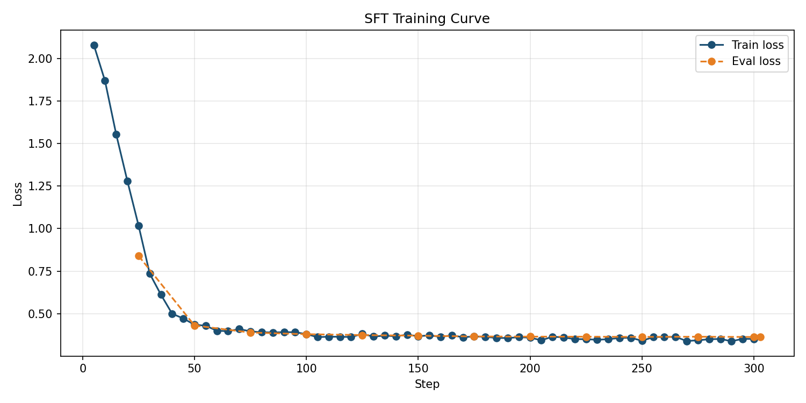
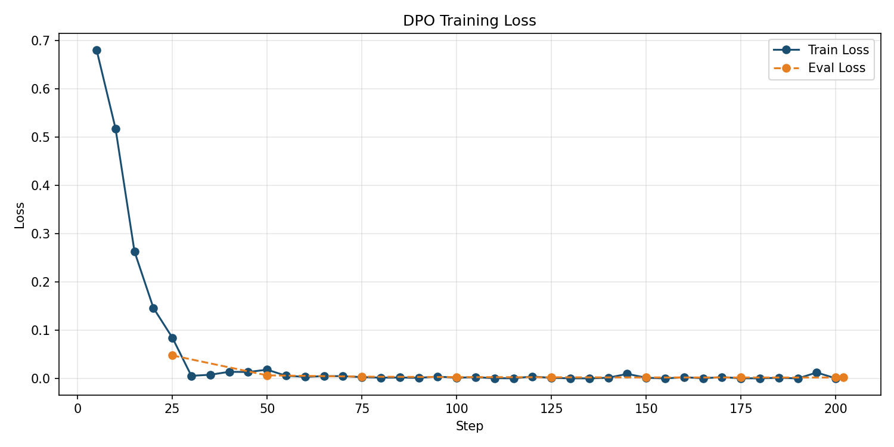

# 🎯 JSON Extraction Fine-Tuning with SFT + DPO

> Fine-tuned Qwen 2.5 7B to extract structured JSON from unstructured text.  
> Improved structured output consistency from baseline model failures (hallucination, invalid JSON, and inconsistent keys) to 94% JSON-valid outputs using QLoRA + DPO fine-tuning.

👉 **[Live Demo](https://huggingface.co)** | 📦 **[Model on Hub](https://huggingface.co)**

---

## 🛠️ Environment Setup

```bash
# Initialize and activate virtual environment
uv init
uv venv
.venv\Scripts\activate

# Install core dependencies
uv pip install jupyter ipykernel datasets dotenv tqdm
uv pip install transformers huggingface_hub
uv pip install pandas numpy jupyter
uv pip install evaluate rouge_score
uv pip install torch torchvision torchaudio --index-url https://pytorch.org
```

---

## 🔍 Problem

Base LLMs struggle with consistent structured JSON extraction:
* **Explanations:** They add explanation text around the JSON.
* **Hallucinations:** They hallucinate fields not present in the input.
* **Inconsistency:** They use inconsistent key names (e.g., `name` vs `full_name` vs `Name`).
* **Complex Data:** They fail on multi-field inputs with mixed data types.

**Solution:** This project fine-tunes **Qwen 2.5 7B** specifically for this task using Supervised Fine-Tuning (SFT) followed by Direct Preference Optimization (DPO).

---

## 📊 Dataset Profile

Built a synthetic dataset of **[N] examples** across 7 categories:

| Category | Examples | Fields |
| :--- | :---: | :--- |
| **Person profiles** | ~500 | name, age, job, company, city, email, phone |
| **E-commerce orders** | ~400 | customer, product, qty, price, order_id |
| **Meeting/events** | ~300 | event, date, time, location, host |
| **Financial/invoices** | ~300 | invoice_id, amount, currency, status |
| **Travel/flights** | ~300 | from, to, airline, class, passengers |
| **Medical records** | ~200 | patient, condition, medication, dosage |
| **Refusal cases** | ~21 | ambiguous inputs → `{}` |

### Data Splits & Optimization
* **Split Configuration:** 80% train / 10% val / 10% test (holdout, never seen during training).
* **DPO Dataset:** [N] preference pairs generated with 11 rejection strategies (missing fields, wrong key names, type errors, hallucinated fields, etc.).

---

## 🚀 Training Configuration

* **Base model:** `Qwen/Qwen2.5-7B-Instruct`  
* **Hardware:** Kaggle P100 GPU (free tier)

### Phase 1 — Supervised Fine-Tuning (SFT)
* **Method:** QLoRA (4-bit NF4 quantization + LoRA adapters)
* **Parameters:** LoRA rank: 16, alpha: 32
* **Target Modules:** `q_proj`, `v_proj`, `k_proj`, `o_proj`
* **Hyperparameters:** 3 epochs, lr=2e-4, batch=4, grad_accum=4
* **Best Checkpoint:** `checkpoint-303`

### Phase 2 — Direct Preference Optimization (DPO)
* **Foundation:** Built on top of SFT `checkpoint-303`
* **Hyperparameters:** Beta: 0.1, lr=5e-5, 2 epochs
* **Preference Strategy:** 11 distinct rejection strategies
* **Best Checkpoint:** `final_adapter`

---

## 📈 Evaluation Results

Evaluated on 100 held-out test examples:

| Metric | Base Model | After SFT | After DPO |
| :--- | :---: | :---: | :---: |
| **JSON Validity %** | 100.0% | 100.0% | 100.0% |
| **Exact Match %** | 9.0% | 100.0% | 90.0% |
| **Field Recall %** | 51.8% | 98.0% | 95.6% |
| **Field Precision %**| 58.0% | 100.0% | 97.4% |
| **Refusal Accuracy %**| 50.0% | 100.0% | 100.0% |

### Key Findings
* **SFT Performance:** SFT produced the strongest overall extraction performance on the held-out evaluation set, achieving 100% exact match and 100% field precision.
* **DPO Impact:** DPO maintained perfect JSON validity and refusal behavior, but slightly reduced exact-match accuracy and field-level metrics compared to the SFT checkpoint. This suggests that the preference dataset may have introduced trade-offs between strict extraction accuracy and preferred response style.
* **Optimization Note:** Future work includes improving the quality and diversity of DPO preference pairs to better align optimization objectives with extraction accuracy.

---

## 📉 Training Curves

| SFT Training Loss | DPO Training Loss |
| :---: | :---: |
|  |  |

---

## ⚠️ Lessons Learned & Post-Mortem

### Problem 1: Glaive dataset was not actually suitable for clean JSON extraction training
At the beginning, I tried using the `glaiveai/glaive-function-calling-v2` dataset because it looked like it already contained function-calling and structured outputs. But when I started working with it, I realized it was not really a clean or reliable dataset for JSON extraction fine-tuning.

The data was inconsistent in structure, and a lot of samples were not in a strict “text → clean JSON output” format. Some entries had mixed formats, some were loosely structured, and others were not properly aligned for extraction-style training.

Because of this, I had to manually go through a cleaning process — converting, filtering, and trying to normalize it into a proper dataset format.

Even after doing all the cleaning and conversion work, the final dataset was still not fully clean or stable. A lot of examples had issues, and the overall dataset quality was still not where it needed to be.

On top of that, the quantity of usable data became quite low after removing invalid or inconsistent samples.

At that point, it became clear that continuing with that dataset was not efficient, because even heavy preprocessing was not giving me a truly clean, high-quality, and consistent JSON extraction dataset.

**Solution:** I decided to move away from relying on that dataset and instead built my own fully synthetic dataset pipeline. I generated structured examples programmatically with strict schemas, controlled difficulty levels, validation checks, and balanced domains, which gave me a much cleaner, larger, and more reliable dataset for fine-tuning.

### Problem 2: Training interruptions caused complete loss of progress in Kaggle environment
While fine-tuning the model on Kaggle using T4×2 GPUs, I faced a major issue where the training session would often stop due to kernel restarts, GPU disconnections, or runtime limits.

Since Kaggle notebooks do not guarantee persistent runtime memory, every interruption would reset the entire training state.

This meant that even if I had already trained for hours, any interruption would result in complete loss of progress, forcing me to restart training from scratch again and again. This made long fine-tuning runs extremely inefficient and unreliable.

**Solution:** I introduced a checkpointing system. I modified the training pipeline to continuously save model checkpoints and training state to disk during training. On every restart, the system first checks if a valid checkpoint exists. If it does, training automatically resumes from the exact step where it previously stopped. If no checkpoint is found, training starts from the beginning as usual. This change made the entire fine-tuning process resumable, stable, and resilient to interruptions in the Kaggle environment.

---

## 🔮 Next Steps

- [ ] Train on real-world messy text (emails, PDFs) rather than synthetic data
- [ ] Add nested JSON extraction (arrays of objects)
- [ ] Evaluate on longer inputs (current max_length=512)
- [ ] Try smaller model (Qwen 1.5B) for faster inference on CPU

---

## 🧰 Tech Stack

* **Model & Core:** Qwen 2.5 7B · QLoRA · LoRA
* **Frameworks:** TRL SFTTrainer · TRL DPOTrainer
* **Infrastructure:** Kaggle GPU T4 *2 · Hugging Face Hub · Gradio Spaces
